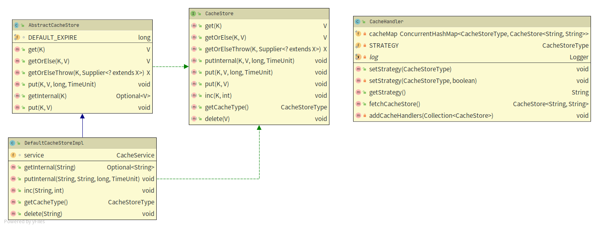
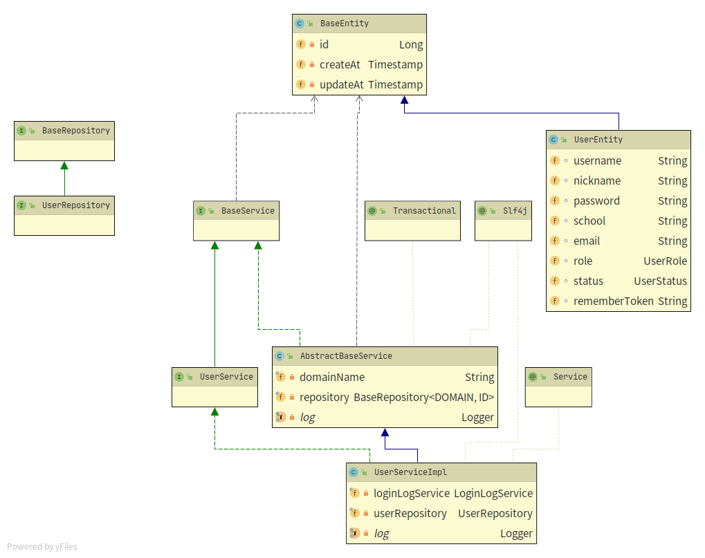

### 缓存

目前缓存主要有两种实现方式：Redis 和 Database。 其中 Database 目前暂不支持expire和sorted list， 仅用于指定的缓存实现崩溃后的请求存储以便后续排查。以下是相关注意事项

- 不同参数**请务必使用`::`进行分割**.一是防止不同方法参数重叠，二是后续可能会根据此规则将数据定时刷新到数据库中指定表，三是方便浏览

- 开发新的缓存实现请继承`AbstractCacheStore<K,V>`并实现相关方法，若非必要**请勿重写**

- 所以查询操作第一方案是尝试从缓存中获取，请尽量不要先进行读取数据库的操作
- **请手动管理缓存**， 缓存Key使用 KeyPrefix 或者 CacheUtil生成。 勿自行拼接
- 在进行更新/新增的时候请**同步更新**对应的sorted list

### 类图参考

