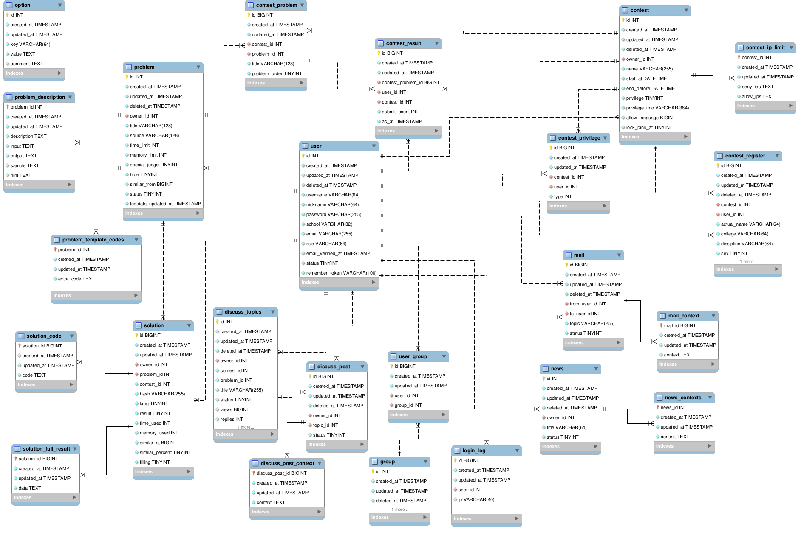

# DATABASE

数据库设计，提供一份带外键的SQL([create-sql.sql](create-sql.sql)， 部分有字段微调) 用于本地开发，不建议用于生产。

目前使用的 `Spring Boot JPA` 无需手动执行 SQL， 只需确保配置的数据库在 MySQL 中实际存在即可。

生产环境中建议使用 OnlineJudge Web Service 端的数据库迁移以导入数据。

想法阐述于[数据库表设计](https://boxjan.com/2019/03/dev-oj-database-table-design.html)

